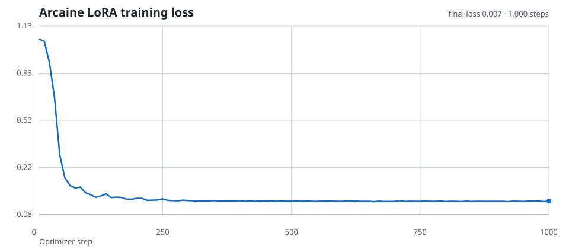

# Arcaine

Arcaine is a tool-using cryptanalysis assistant. This repository contains the reproducible dataset builders, local tool implementations, and Modal jobs used to train and serve its Qwen3.5 LoRA adapter.



The chart is generated from the completed Modal run's persisted metrics. Versioned visual assets live in `assets/`; transient plots belong in ignored `output/`.

## Repository layout

- `crypto_agent/` — deterministic probes, verification, tool contracts, and trajectory construction.
- `dataset/` — blind, oracle-backed synthetic-record generators.
- `scripts/` — local dataset build, Pi tool bridge, and API client.
- `modal_app/` — isolated Modal training, serving, and training-supervisor entry points.

Generated datasets, checkpoints, logs, keys, virtual environments, notebooks, archives, and images are intentionally excluded from version control. Hugging Face is the source of truth for datasets and model artifacts.

## Prerequisites

- Python 3.11+
- [Modal](https://modal.com/docs) authenticated with `modal setup`
- A Modal secret named `huggingface` containing `HF_TOKEN` with write access to the private Hugging Face repos
- A Modal secret named `arcaine-api` containing `ARCAINE_API_KEY` for serving

Install the local orchestration dependency:

```bash
python3 -m pip install -r requirements.txt
```

## Hugging Face assets

| Asset | Repository |
| --- | --- |
| Agentic training dataset | `aether5896/arcaine_dataset` |
| Completed LoRA adapter | `aether5896/arcaine-agentic-lora-v8` |

Validate the remote dataset and its splits without provisioning a GPU:

```bash
modal run modal_app/train.py::inspect_dataset
```

The dataset has `train` and `test` splits with Qwen/OpenAI-style `messages` and `tools` fields. Do not commit copies of those JSONL files here.

## Build a dataset

Build raw blind records from a local plaintext corpus, then keep only records whose solution can be independently rediscovered and round-trip verified:

```bash
python3 scripts/generate_blind_crypto_dataset.py \
  --plaintext-file /path/to/plaintext.txt \
  --output output/arcaine.raw.jsonl \
  --rows 12000

python3 scripts/build_agentic_sft.py \
  --input output/arcaine.raw.jsonl \
  --output output/arcaine.agentic.jsonl \
  --test-split 0.1
```

Upload the resulting data to the private dataset repository with the Hugging Face CLI or API; retain only the Hub copy once verified.

## Train and publish

Start or resume training:

```bash
modal run modal_app/train.py --max-steps 1000
```

For a restart-on-failure loop:

```bash
modal_app/train.sh
```

The trainer saves the adapter to the persistent `qwen35-sft-checkpoints` Modal Volume and normally pushes it to the configured model repo after training. To publish the already-completed adapter from that Volume explicitly:

```bash
modal run modal_app/train.py::publish_adapter
```

## Serve and use

Deploy the OpenAI-compatible vLLM endpoint:

```bash
modal deploy modal_app/serve.py
```

Call it using an API key from the environment (never commit the key):

```bash
ARCAINE_API_KEY=... python3 scripts/arcaine.py "KHOOR"
```

## Security

The included Python tool runner is designed for a disposable, restricted environment; it is not a hardened sandbox. Never expose it on a host containing credentials or unrestricted network access.
